15Gene-ccRCC
================
Srinivas Nallandhighal
2024-05-13

# Prepare files to plot Figure-1B

``` r
# Combine UM and TCGA data
y.comb <- data.frame(y.myr,y.tcga,row.names = rownames(y.myr))
dim(y.comb)
```

    ## [1] 32265   485

``` r
annot.comb <- master.annot.myriad
master.pheno <- master.pheno[rownames(master.pheno) %in% colnames(y.comb),]
all(rownames(master.pheno)==colnames(y.comb))
```

    ## [1] TRUE

``` r
all(rownames(y.comb)==rownames(annot.comb))
```

    ## [1] TRUE

``` r
# Create expressionset
pd.comb <- new("AnnotatedDataFrame", data = master.pheno, varMetadata = data.frame(cbind(colnames(master.pheno), rep("stuff", length(colnames(master.pheno))))))
fd.comb <- new("AnnotatedDataFrame", data = annot.comb, varMetadata = data.frame(cbind(colnames(annot.comb), rep("stuff", length(colnames(annot.comb))))))

all.eset <- newSeqExpressionSet(counts = as.matrix(y.comb), phenoData = pd.comb, featureData = fd.comb)
dim(all.eset)
```

    ## Features  Samples 
    ##    32265      485

``` r
# Create DGE list
y.all   <- DGEList(count = y.comb, genes= annot.comb,group = master.pheno$COHORT, remove.zeros=T,lib.size = colSums(y.comb))
summary(y.all$samples$group)
```

    ## TCGA  U-M 
    ##  382  103

``` r
# Normalization
y.all <- calcNormFactors(y.all)

# Filter low expression genes
selr <- rowSums(cpm(y.all$counts)>2)>=103  #(round(ncol(y)/2,digits = 0))
selc <- colSums(y.all$counts)>=4500000 #Filter samples based on library size
y.all <- y.all[selr,selc]
dim(y.all)
```

    ## [1] 14216   473

``` r
### Exclude gender specific genes from the analysis
data(genderGenes)
y.all <- y.all[!(y.all$genes$gene_id %in% c(XiEgenes,msYgenes)),]
dim(y.all)
```

    ## [1] 14153   473

``` r
# Log CPM values
e.all <- cpm(y.all,log=T)
dim(e.all)
```

    ## [1] 14153   473

``` r
annot.sub <- annot.comb[rownames(annot.comb) %in% rownames(e.all),]

# Limit to filtered data #
sub.eset <- all.eset[rownames(y.all$counts),]
sub.eset <- sub.eset[,colnames(y.all$counts)]
sub.eset
```

    ## SeqExpressionSet (storageMode: lockedEnvironment)
    ## assayData: 14153 features, 473 samples 
    ##   element names: counts, normalizedCounts, offset 
    ## protocolData: none
    ## phenoData
    ##   sampleNames: SI_15000 SI_15001 ... TCGA.CJ.6032 (473 total)
    ##   varLabels: age_at_initial_pathologic_diagnosis histological_grade ...
    ##     COHORT (9 total)
    ##   varMetadata: X1 X2 labelDescription
    ## featureData
    ##   featureNames: ENSG00000004059.11 ENSG00000003056.8 ...
    ##     ENSG00000148400.12 (14153 total)
    ##   fvarLabels: gene_id gene_name Entrez
    ##   fvarMetadata: X1 X2 labelDescription
    ## experimentData: use 'experimentData(object)'
    ## Annotation:

``` r
pd.sub <- new("AnnotatedDataFrame", data = pData(sub.eset), varMetadata = data.frame(cbind(colnames(pData(sub.eset)), rep("stuff", length(colnames(pData(sub.eset))))))) #take data from filtered.set to make new pd and fd
fd.sub <- new("AnnotatedDataFrame", data = fData(sub.eset), varMetadata = data.frame(cbind(colnames(fData(sub.eset)), rep("stuff", length(colnames(fData(sub.eset)))))))
cpm.eset <- ExpressionSet(assayData = e.all, phenoData = pd.sub, featureData = fd.sub) #trick here is to use ExpressionSet not seqExpressionSet
cpm.eset$annotation <- factor(ifelse(cpm.eset$PFI==0,"No","Yes"),levels = c("No","Yes"))
cpm.eset$Recurrence <- factor(paste0(cpm.eset$COHORT,"-",cpm.eset$annotation),labels = c("TCGA-No","TCGA-Yes","UM-No","UM-Yes"))

# PCA plot
set.seed(123)
d.all <- exprs(cpm.eset)
td <- t(d.all)
pca <- prcomp(td)

cols <- c("TCGA-No"="#8856a7","TCGA-Yes"="#2ca25f","UM-No"="#3182bd","UM-Yes"="red")

var.exp <- stats:::summary.prcomp(pca)$importance[2, ]
a1 <- autoplot(pca, data = pData(cpm.eset), colour = 'Recurrence', x = 1, y = 2, size = 3) +
  theme_bw() +
  theme(axis.text = element_text(size=10), axis.title.y = element_text(size = 10), axis.title.x = element_text(size = 10))+
  theme(legend.position= "top") + theme(panel.grid.major = element_blank(),
                                        panel.grid.minor = element_blank(),
                                        strip.background = element_blank()) +
  scale_color_manual(values=cols)+
  ggtitle("Before removing batch effects") + 
  labs(x = paste0("PC1 (", signif(100*var.exp[1],3),"% variation explained)"),
       y = paste0("PC2 (", signif(100*var.exp[2],3),"% variation explained)"))
a1
```

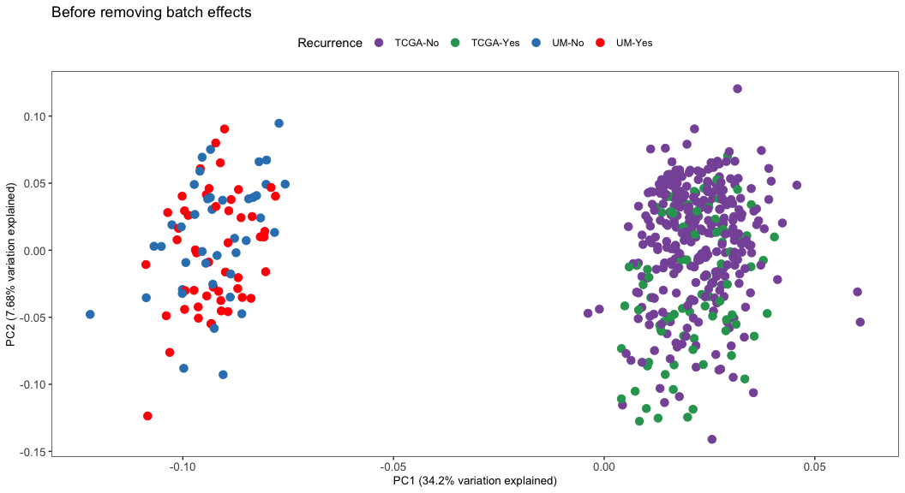<!-- -->

``` r
######### Removing batch effects; couple ways 1) limma removebatcheffect, 2) sva's combat
library(limma)
e.all.rem <- removeBatchEffect(e.all,batch = factor(sub.eset$COHORT))
dim(e.all.rem)
```

    ## [1] 14153   473

``` r
pd.rem <- new("AnnotatedDataFrame", data = pData(sub.eset), varMetadata = data.frame(cbind(colnames(pData(sub.eset)), rep("stuff", length(colnames(pData(sub.eset))))))) #take data from filtered.set to make new pd and fd
fd.rem <- new("AnnotatedDataFrame", data = fData(sub.eset), varMetadata = data.frame(cbind(colnames(fData(sub.eset)), rep("stuff", length(colnames(fData(sub.eset)))))))
cpm.eset.rem <- ExpressionSet(assayData = e.all.rem, phenoData = pd.rem, featureData = fd.rem) #trick here is to use ExpressionSet not seqExpressionSet
cpm.eset.rem$annotation <- factor(ifelse(cpm.eset.rem$PFI==0,"No","Yes"),levels = c("No","Yes"))
cpm.eset.rem$Recurrence <- factor(paste0(cpm.eset.rem$COHORT,"-",cpm.eset.rem$annotation),labels = c("TCGA-No","TCGA-Yes","UM-No","UM-Yes"))

# PCA plot
set.seed(123)
d.all.rem <- exprs(cpm.eset.rem) #see above #take expression matrix from cpm.eset above
td.rem <- t(d.all.rem)
pca.rem <- prcomp(td.rem)

var.exp.rem <- stats:::summary.prcomp(pca.rem)$importance[2, ]
a2 <- autoplot(pca.rem, data = pData(cpm.eset.rem), colour = 'Recurrence', x = 1, y = 2, size = 3) +
  theme_bw() +
  theme(axis.text = element_text(size=10), axis.title.y = element_text(size = 10), axis.title.x = element_text(size = 10))+
  theme(legend.position= "top") + theme(panel.grid.major = element_blank(),
                                        panel.grid.minor = element_blank(),
                                        strip.background = element_blank()) +
  ggtitle("After removing batch effects") +
  scale_color_manual(values=cols)+
  labs(x = paste0("PC1 (", signif(100*var.exp.rem[1],3),"% variation explained)"),
       y = paste0("PC2 (", signif(100*var.exp.rem[2],3),"% variation explained)"))
a2
```

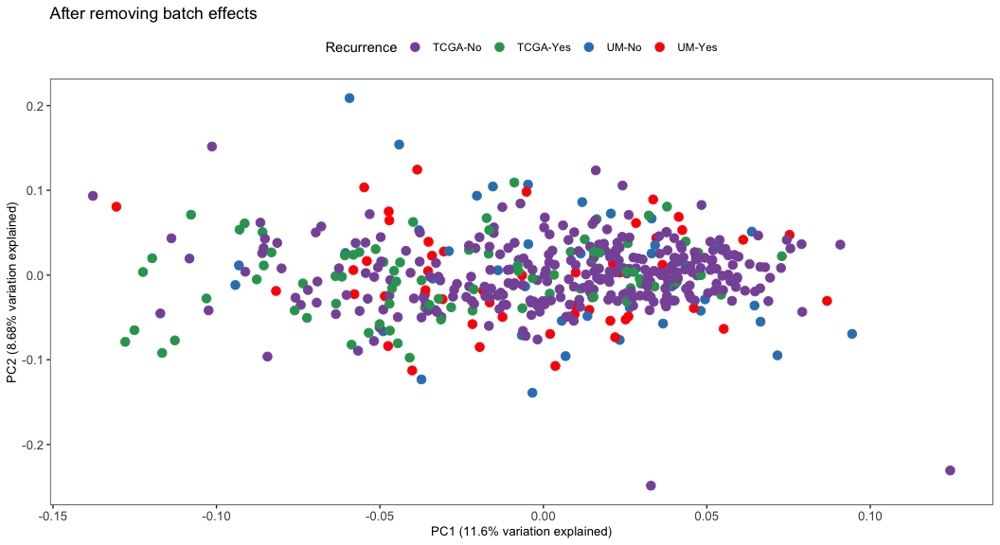<!-- -->

``` r
# ggarrange(a1,a2,nrow=2,ncol=1)
```

# Prepare files to plot Figure-1C

``` r
# Get the gene names for the top 1000 most variable genes
selet_x <- names(var_genes[var_genes > 2.7])
selet_y <- names(var_samps)

e.symb <- y[[3]]
e.symb <- e.symb[rownames(e.symb) %in% selet_x,]

e.sel <- data.matrix(e[rownames(e) %in% rownames(e.symb),])
e.sel <- sweep(e.sel,1,apply(e.sel,1,median))

e.symb <- e.symb[match(rownames(e.sel),rownames(e.symb)),]
x.comp <- hclust(dist(cosine(e.sel),method="euclidean"),method="complete")

e.sel[e.sel >= 4] <- 4
e.sel[e.sel <= -4] <- -4

all(rownames(e.symb)==rownames(e.sel))
```

    ## [1] TRUE

``` r
annotations <- pData(filtered.eset)
annotations <- annotations[rownames(annotations) %in% colnames(e.sel),c(5,6,8,29,30,17,18,19,20,24,25,34)]
annotations <- annotations[,c(6,7,9,10,12,1,2,3)]
all(rownames(annotations)==colnames(e.sel))
```

    ## [1] TRUE

``` r
tide <- read.csv("/Users/srnallan/Desktop/Morgan lab/prolaris_131119/Analysis/TIDE_UM_CCRCC.csv",header = T)
annotations <- pData(filtered.eset)
annotations <- annotations[rownames(annotations) %in% colnames(e.sel),c(5,6,8,29,30,17,18,19,20,24,25,34)]
annotations <- annotations[,c(6,7,9,10,12,1,2,3)]
all(rownames(annotations)==colnames(e.sel))
```

    ## [1] TRUE

``` r
tide <- tide[tide$Patient %in% rownames(annotations),]
tide <- tide[match(rownames(annotations),tide$Patient),]
all(tide$Patient==rownames(annotations))
```

    ## [1] TRUE

``` r
res.g15 <- read.csv("/Users/srnallan/Desktop/Morgan lab/prolaris_131119/Analysis/training results myriad.csv",header = T,row.names = 1)
all(rownames(annotations)==rownames(res.g15))
```

    ## [1] TRUE

``` r
annotations$Tstage <- factor(annotations$Tstage,
                             levels = c("1a","1b","2a","2b","3a","3b","3c"),
                             labels = c("1","1","2","2","3a","3b","3c"))
annotations$Grade <- factor(annotations$Grade)
annotations$annotation <- factor(annotations$annotation,
                                 levels=c("Primary no MET","Primary with MET"),
                                 labels = c("No","Yes"))
annotations <- data.frame(Risk.15G=factor(res.g15$Cox.risk,
                                          levels = c("Low","High")),
                          TIDE=factor(tide$Responder,
                                      levels = c("True","False"),
                                      labels = c("Responder","Non-responder")),
                          annotations,row.names = rownames(annotations))
names(annotations)[[10]] <- "Recurrence"

Var1 <- c("gray80","gray70","gray40","gray20","black")
Var2 <- c("gray","#fdbf6f","green","maroon")
Var3 <- c("#3182bd","red")
Var4 <- c("black","gray80","gray40")
Var5 <- c("white","black")
Var6 <- c("black","white")
Var7 <- c("black","white")
Var8 <- c("white","gray60","gray20")
Var9 <- c("black","white")
Var10 <- c("#ff7f00","white")
Var11 <- c("lightpink","white")
Var12 <- c("lightpink","paleturquoise")
Var13 <- c("khaki1","orchid3")
Var14 <- c("turquoise","purple3")

names(Var1) <- names(summary(annotations$Tstage))
names(Var2) <- names(summary(annotations$Grade))
names(Var3) <- names(summary(annotations$Recurrence))
names(Var6) <- names(summary(annotations$Necrosis))
names(Var7) <- names(summary(annotations$Angiolymphatic.invasion))
names(Var9) <- names(summary(annotations$Adjuvant.therapy))
names(Var10) <- names(summary(annotations$Died.of.Disease))
names(Var12) <- names(summary(annotations$Sex))
names(Var13) <- names(summary(annotations$TIDE))
names(Var14) <- names(summary(annotations$Risk.15G))

ann_colors = list(Tstage = Var1,Grade=Var2,Recurrence = Var3,Necrosis=Var6,
                  Angiolymphatic.invasion=Var7,Adjuvant.therapy=Var9,
                  Died.of.Disease=Var10,Sex=Var12,TIDE=Var13,Risk.15G=Var14)

all(rownames(e.symb)==rownames(e.sel))
```

    ## [1] TRUE

``` r
all(colnames(e.sel)==rownames(annotations))
```

    ## [1] TRUE

``` r
colors.hm <- colorRampPalette(c("#2b83ba","#abdda4","#ffffbf","#fc8d59","#d7191c"))(100)

all(colnames(e.sel)==rownames(annotations))
```

    ## [1] TRUE

``` r
# Draw heatmap
out.comp <- pheatmap(e.sel, color = colors.hm, annotation_colors = ann_colors,
                     fontsize_col = 6,fontsize_row = 2,show_colnames = F,
                     labels_row = e.symb$gene_name,cluster_cols = x.comp,
                     clustering_distance_rows = "correlation",cutree_cols = 3,
                     annotation_col = annotations,main = "Top 10% most variable genes UM cohort")
```

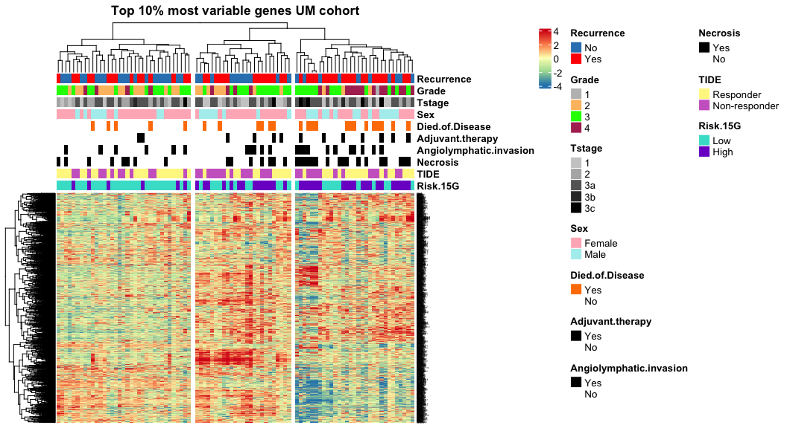<!-- -->

# Prepare files to plot Figure-1D

``` r
# limma Primaries recurrence Yes vs No
df.difex <- pData(filtered.eset)
mets <- factor(df.difex$annotation,levels = c("Primary no MET","Primary with MET"),labels = c("No","Yes"))

design <- model.matrix(~0+mets)
rownames(design) <- rownames(df.difex)
colnames(design)
```

    ## [1] "metsNo"  "metsYes"

``` r
y.voo <- voom(y[,colnames(y) %in% rownames(design)],design,plot=F)
fit.voom <- lmFit(y.voo,design)
contrast.matrix <- makeContrasts(
  comp1 = metsYes - metsNo,
  levels=design)
tmp <- contrasts.fit(fit.voom,contrast.matrix)
tmp <- eBayes(tmp)

top.table11 <- topTable(tmp,coef = 1, sort.by = "P", n = Inf)
topdeg11 <- subset(top.table11,P.Value < 0.05)
topdeg11$Comparison <- "Primary METS Yes vs No"
topdeg11$Direction <- ifelse(topdeg11$logFC >0.585,"Up","Down")
topdeg11$Method <- "limma-voom"
top.table11 <- top.table11[!top.table11$gene_name %in% top.table11[duplicated(top.table11$gene_name),]$gene_name,]
rownames(top.table11) <- top.table11$gene_name

keyvals <- ifelse(
  top.table11$logFC < -0.585 & top.table11$P.Value < 0.05, '#3182bd',
  ifelse(top.table11$logFC > 0.585 & top.table11$P.Value < 0.05, 'red',
         'gray'))
keyvals[is.na(keyvals)] <- 'gray'

names(keyvals)[keyvals == 'red'] <- 'Recurrence'
names(keyvals)[keyvals == 'gray'] <- 'Not significant'
names(keyvals)[keyvals == '#3182bd'] <- 'No-recurrence'

# Enhanced Volcano H=9,W=13
EnhancedVolcano(top.table11,
                lab = rownames(top.table11),
                selectLab = rownames(top.table11)[which(names(keyvals) %in% c('Recurrence', 'No-recurrence'))],
                x = 'logFC',
                y = 'P.Value',
                xlim = c(-2,2),ylim=c(0,4),
                title = paste0("Recurrence vs No-recurrence","\n","nUP=",table(topdeg11$Direction)[[2]],
                               "; nDOWN=",table(topdeg11$Direction)[[1]]),
                colCustom = keyvals,
                colAlpha = 1,
                subtitle = "Limma",
                pCutoff = 0.05,
                xlab = "Enriched in Non-recurrence <--- Log2 fold change ---> Enriched in Recurrence",
                FCcutoff = 0.585,pointSize = 3,labSize = 4,maxoverlapsConnectors = 20,
                drawConnectors = T,widthConnectors = 0.5,colConnectors = 'grey30')
```

<!-- -->

# Prepare files to plot Figures-1E

``` r
dfgsea <- top.table11
ranks1 <- dfgsea[order(-dfgsea[,"logFC"]),]$logFC
names(ranks1) <- dfgsea[order(-dfgsea[,"logFC"]),]$gene_name
table(factor(ifelse(ranks1>0,"Up","Down")))
```

    ## 
    ## Down   Up 
    ## 8241 8104

``` r
set.seed(123)
fgseaRes1 <- fgseaMultilevel(all.sig1,ranks1,minSize=10,maxSize = 500,gseaParam = 1,eps=0)
fgseplot1 <- fgseaRes1[,c("pathway","padj","NES")]

fgseplot1$pathway <- gsub("HALLMARK","Hallmark",fgseplot1$pathway)
fgseplot1$pathway <- gsub("_"," ",fgseplot1$pathway)

fgseplot1 <- orderBy(~ -NES + padj,fgseplot1)
fgseplot1$padj <- round(fgseplot1$padj,3)
fgseplot1$Significance <- factor(ifelse(fgseplot1$padj<0.05 & fgseplot1$NES>0,"Up; FDR < 5%",
                                        ifelse(fgseplot1$padj<0.05 & fgseplot1$NES<0,"Down; FDR < 5%","Not significant")),
                                 levels = c("Up; FDR < 5%","Down; FDR < 5%","Not significant"),
                                 labels=c("Enriched in Recurrence","Enriched in Non-recurrence","Not significant"))
fgseplot1 <- fgseplot1[fgseplot1$Significance!="Not significant",]
# fgseplot1 <- fgseplot1[!grepl("ESTROGEN",fgseplot1$pathway),]
fgseplot1$pathway <- factor(fgseplot1$pathway,levels = c(fgseplot1$pathway))
fill <- c("red","#3182bd")

fg1 <- ggplot(data = fgseplot1, aes(x = pathway, y = NES,fill=Significance)) +
  geom_bar(stat="identity",width=.5) + coord_flip()+theme_bw()+
  theme(panel.grid.major = element_blank(), panel.grid.minor = element_blank(),
        panel.background = element_blank(), axis.line = element_blank())+
  scale_fill_manual(values =fill) + xlab("")+ylab("Enriched in Non-recurrence <-- NES --> Enriched in Recurrence")+
  theme(axis.title.x = element_text(size=14))+ theme(legend.text = element_text(size = 15))+
  theme(axis.text.y = element_text(size =  10,colour = "black")) +
  theme(axis.text.x = element_text(size =  15,colour = "black")) +
  theme(plot.title = element_text(size =  15,colour = "black",face = "bold")) +
  ggtitle(paste0("Hallmark plus XCell nGenes=",nrow(top.table11))) +
  scale_x_discrete(limits = rev(levels(fgseplot1$pathway)))
fg1
```

<!-- -->

# \# Prepare files to plot Figures-2A,2B

``` r
int.gene <- intersect(as.character(gen.g.pfi$Gene),as.character(gen.g.os$Gene))
int.symb <- all.symb[all.symb$gene_name %in% int.gene,]

sub.exp <- e.all.rem[rownames(e.all.rem) %in% rownames(int.symb),colnames(e.all.rem) %in% rownames(df.des)]
all(rownames(int.symb)==rownames(sub.exp))
```

    ## [1] TRUE

``` r
int.symb$Avg.exp <- rowMeans(as.matrix(sub.exp))

trt.rec <- apply(sub.exp[,colnames(sub.exp) %in% rownames(df.des[df.des$Any.recurrence==1,])],1,mean)
ctrl.rec <- apply(sub.exp[,colnames(sub.exp) %in% rownames(df.des[df.des$Any.recurrence==0,])],1,mean)

trt.death <- apply(sub.exp[,colnames(sub.exp) %in% rownames(df.des[df.des$Died.of.Disease==1,])],1,mean)
ctrl.death <- apply(sub.exp[,colnames(sub.exp) %in% rownames(df.des[df.des$Died.of.Disease==0,])],1,mean)

all(names(trt.rec)==names(trt.death))
```

    ## [1] TRUE

``` r
all(names(ctrl.rec)==names(ctrl.death))
```

    ## [1] TRUE

``` r
all(names(trt.rec)==names(ctrl.death))
```

    ## [1] TRUE

``` r
all(names(trt.rec)==rownames(int.symb))
```

    ## [1] TRUE

``` r
int.symb$FC.rec <- 2^(trt.rec-ctrl.rec)

int.symb <- int.symb[order(int.symb$FC.rec,decreasing = T),]
# int.symb <- int.symb[int.symb$FC.rec > 1.25 & int.symb$Avg.exp > 1,]
# int.symb <- int.symb[int.symb$gene_name %in% fin.coef[fin.coef$Freq >1,]$Var1,]
# int.symb$gene_name

myr.15 <- c("IGF2BP3","PTK6" ,   "BOLA3" ,  "UQCRH" ,  "TFCP2L1" ,"SLC7A8" , "SLC16A1",
            "PLIN5"  , "TMEM136", "SLC7A1" , "TMEM81",  "RPL22L1", "ELOB"  ,  "IQCC"   ,
            "TAGLN2")

int.symb <- int.symb[int.symb$gene_name %in% myr.15,]
int.symb$gene_name
```

    ##  [1] "IGF2BP3" "PTK6"    "BOLA3"   "UQCRH"   "TFCP2L1" "SLC7A8"  "SLC16A1"
    ##  [8] "PLIN5"   "SLC7A1"  "TMEM136" "RPL22L1" "ELOB"    "TMEM81"  "IQCC"   
    ## [15] "TAGLN2"

``` r
# Train data for cox lasso
train.df.cox <- data.frame(PFI.time=df.des$Time.to.recurrence,
                           PFI.obs=df.des$Any.recurrence,
                           t(e.all.rem[rownames(e.all.rem) %in% c(rownames(int.symb)),colnames(e.all.rem) %in% rownames(df.des)]))
all(rownames(int.symb)==c(colnames(train.df.cox)[3:ncol(train.df.cox)]))
```

    ## [1] FALSE

``` r
train.df.cox <- train.df.cox[,match(c("PFI.time","PFI.obs",rownames(int.symb)),colnames(train.df.cox))]
all(rownames(int.symb)==c(colnames(train.df.cox)[3:ncol(train.df.cox)]))
```

    ## [1] TRUE

``` r
colnames(train.df.cox) <- c("PFI.time","PFI.obs",int.symb$gene_name)
train.df.cox$PFI.time <- ifelse(train.df.cox$PFI.time==0,0.2,train.df.cox$PFI.time)

# Cox lasso model
set.seed(55, kind = "L'Ecuyer-CMRG")
coxlasso <- cv.glmnet(x=data.matrix(train.df.cox[,3:ncol(train.df.cox)]),
                      y=Surv(train.df.cox$PFI.time,train.df.cox$PFI.obs),
                      family = "cox",nfolds = 15,type.measure = "C")
plot(coxlasso)
coxlasso
```

    ## 
    ## Call:  cv.glmnet(x = data.matrix(train.df.cox[, 3:ncol(train.df.cox)]),      y = Surv(train.df.cox$PFI.time, train.df.cox$PFI.obs), type.measure = "C",      nfolds = 15, family = "cox") 
    ## 
    ## Measure: C-index 
    ## 
    ##      Lambda Index Measure      SE Nonzero
    ## min 0.00610    42  0.7550 0.06089      15
    ## 1se 0.03255    24  0.7158 0.05900      15

``` r
training <- data.frame(PFI.time=df.des$Time.to.recurrence,
                       PFI.obs=df.des$Any.recurrence,
                       DSS.time=df.des$Time.to.death,
                       DSS.obs=df.des$Died.of.Disease,
                       Prediction.coxlasso=round(predict(coxlasso,newx = data.matrix(train.df.cox[,-c(1,2)]),type="link"),4),
                       CCP.score=df.des$CCP.Sri,
                       SSIGN=df.des$SSIGN,
                       Nomogram=df.des$Nomogram,
                       row.names = rownames(train.df.cox))

cp.risk <- cutpointr(training, X1, PFI.obs, 
                     method = oc_youden_kernel, metric = sum_sens_spec)
risk.cp <- round(cp.risk$optimal_cutpoint,2)
risk.cp
```

    ## [1] 8.24

``` r
ccp.risk <- cutpointr(training, CCP.score, PFI.obs, 
                      method = oc_youden_kernel, metric = sum_sens_spec)
risk.ccp <- round(ccp.risk$optimal_cutpoint,2)
risk.ccp
```

    ## [1] 0.19

``` r
training$Cox.risk <- factor(ifelse(training$X1 > risk.cp,"High","Low"),levels = c("Low","High"))
training$CCP <- factor(ifelse(training$CCP.score > risk.ccp,"High","Low"),levels = c("Low","High"))
training$IGF2BP3 <- factor(ifelse(train.df.cox$IGF2BP3 > median(train.df.cox$IGF2BP3),"High","Low"),levels = c("Low","High"))
training$PFI.time <- ifelse(training$PFI.time > 90,90,training$PFI.time)
training$DSS.time <- ifelse(training$DSS.time > 90,90,training$PFI.time)

# PFI
cox_fit1.train <- survfit(Surv(PFI.time, PFI.obs) ~ Cox.risk, data=training)
g1.train <- ggsurvplot(cox_fit1.train,pval = T, risk.table = T,break.time.by=30,legend.title="Group:",
                       title=paste0("Figure-2A"),
                       xlab="Disease-Free Interval (Time in months)",
                       surv.median.line = "hv", palette = c("blue","red"))    # ,"green","#E7B800"
g1.train

# DSS
cox_fit2.train <- survfit(Surv(DSS.time, DSS.obs) ~ Cox.risk, data=training)
g2.train <- ggsurvplot(cox_fit2.train,pval = T, risk.table = T,break.time.by=30,legend.title="Group:",
                       title=paste0("Figure-2B"),
                       xlab="Disease Specific Survival (Time in months)",
                       surv.median.line = "hv", palette = c("blue","red"))    # ,"green","#E7B800"
g2.train
```

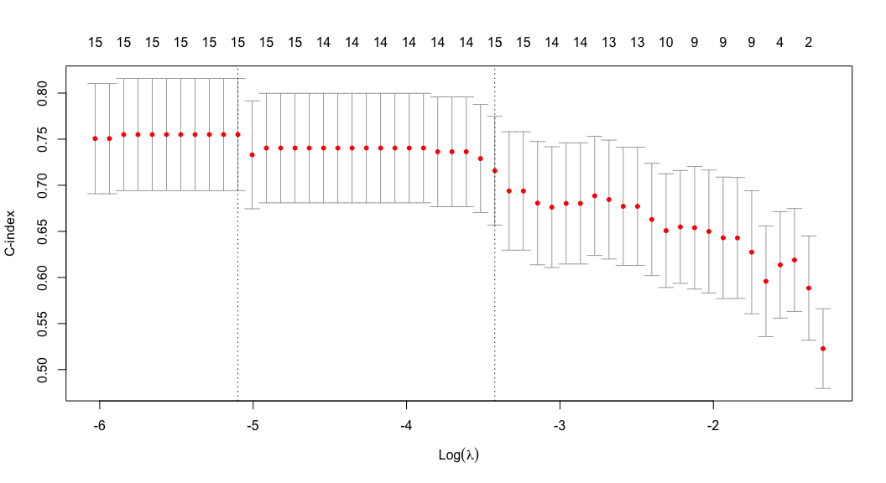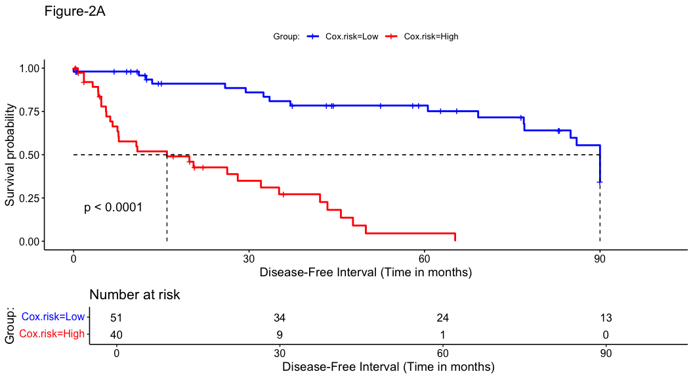

# Prepare files to plot Figures-2C, 2D

``` r
training$Age <- df.des$AgeAtOp
training$Sex <- df.des$gender
training$Side <- df.des$Side
training$Fuhrman.Grade <- factor(ifelse(df.des$Grade %in% c(1,2),"G1-2","G3-4"),levels = c("G1-2","G3-4"))
training$Tstage <- factor(ifelse(df.des$Tstage %in% c("3a","3b","3c"),"T3-4","T1-2"),levels = c("T1-2","T3-4"))
training$SSIGN <- factor(ifelse(training$SSIGN >= 4, "High","Low"),levels=c("Low","High"))
training$Nomogram <- factor(ifelse(training$Nomogram > 1.5,"High","Low"),levels = c("Low","High"))

## Cox PFI
coxfit1 <- coxph(Surv(PFI.time,PFI.obs) ~ Age+Sex+Fuhrman.Grade+Tstage+CCP+Cox.risk,data=training)
ggforest(coxfit1,fontsize = 1,main = paste0("Figure-2C"))

## Cox DSS
coxfit2 <- coxph(Surv(DSS.time,DSS.obs) ~ Age+Sex+Fuhrman.Grade+Tstage+CCP+Cox.risk,data=training)
ggforest(coxfit2,fontsize = 1,main = paste0("Figure-2D"))
```


# Prepare files to plot Figures-3

``` r
test.tcga <- test.tcga1[rownames(test.tcga1) %in% rownames(int.symb),]
all(colnames(test.tcga)==rownames(samps.df))
```

    ## [1] TRUE

``` r
test.tcga <- test.tcga[match(rownames(int.symb),rownames(test.tcga)),]
all(rownames(test.tcga)==rownames(int.symb))
```

    ## [1] TRUE

``` r
rownames(test.tcga) <- int.symb$gene_name

validation.tcga <- data.frame(Age=samps.df$age_at_initial_pathologic_diagnosis,
                              Sex=factor(samps.df$gender,levels = c("FEMALE","MALE"),labels = c("Female","Male")),
                              Side=factor(samps.df$LATERALITY,levels = c("Right","Left")),
                              Fuhrman.Grade=factor(samps.df$Grade.group),
                              Tstage=factor(samps.df$Tstage.group),
                              PFI.obs=samps.df$PFI,
                              OS.obs=samps.df$OS,
                              DSS.obs=samps.df$DSS,
                              PFI.time=samps.df$PFI.time/30,
                              OS.time=samps.df$OS.time/30,
                              DSS.time=samps.df$DSS.time/30,
                              # Prediction.glmnet = predict(pred_model,type="raw", newdata = test.tcga),
                              Prediction.coxlasso=round(predict(coxlasso,newx=data.matrix(t(test.tcga)),type="link"),4),
                              CCP.score=samps.df$CCP.score,
                              row.names = rownames(samps.df))

validation.tcga$Cox.risk <- factor(ifelse(validation.tcga$X1 > risk.cp,"High","Low"),levels = c("Low","High"))
validation.tcga$CCP <- factor(ifelse(validation.tcga$CCP.score > 0.7,"High","Low"),levels = c("Low","High"))   # cut-off from TCGA CCP EMT paper
df.tcga <- data.frame(t(test.tcga))

# PFI
cox_fit1.test <- survfit(Surv(PFI.time, PFI.obs) ~ Cox.risk, data=validation.tcga)
g1.test <- ggsurvplot(cox_fit1.test,pval = T, risk.table = T,break.time.by=60,legend.title="Group:",
                      title=paste0("Figure-3A"),
                      xlab="PDisease-Free Interval (Time in months)",
                      surv.median.line = "hv", palette = c("blue","red"))
g1.test

# DSS
cox_fit3.test <- survfit(Surv(DSS.time, DSS.obs) ~ Cox.risk, data=validation.tcga)
g3.test <- ggsurvplot(cox_fit3.test,pval = T, risk.table = T,break.time.by=60,legend.title="Group:",
                      title=paste0("Figure-3B"),
                      xlab="Disease Specific Survival (Time in months)",
                      surv.median.line = "hv", palette = c("blue","red"))
g3.test

### COX
valid1 <- validation.tcga[validation.tcga$Fuhrman.Grade!="Unknown",]
valid1$Fuhrman.Grade <- factor(valid1$Fuhrman.Grade,levels = c("G1-2","G3-4"))

## Cox PFI
coxfit3 <- coxph(Surv(PFI.time,PFI.obs) ~ Age+Sex+Fuhrman.Grade+Tstage+CCP+Cox.risk,data=valid1)
ggforest(coxfit3,fontsize = 1,main = paste0("Figure-3C"))

## Cox DSS
coxfit5 <- coxph(Surv(DSS.time,DSS.obs) ~ Age+Sex+Fuhrman.Grade+Tstage+CCP+Cox.risk,data=valid1)
ggforest(coxfit5,fontsize = 1,main = paste0("Figure-3D"))
```

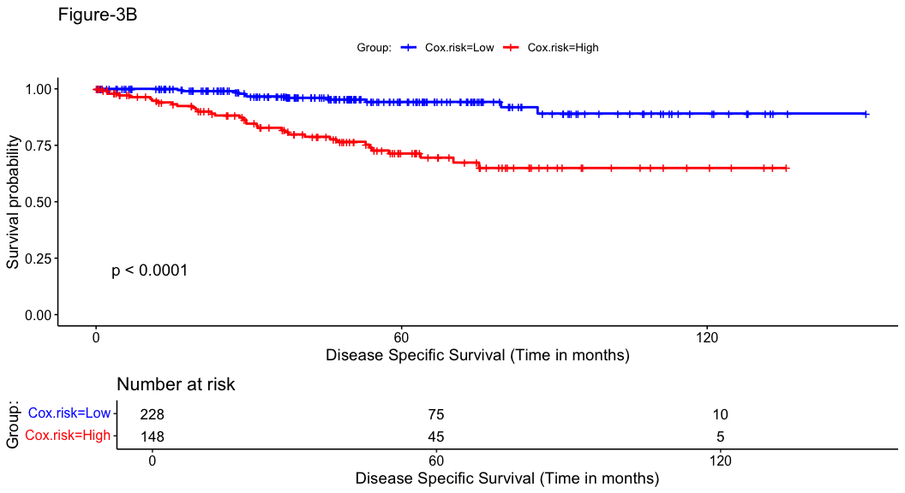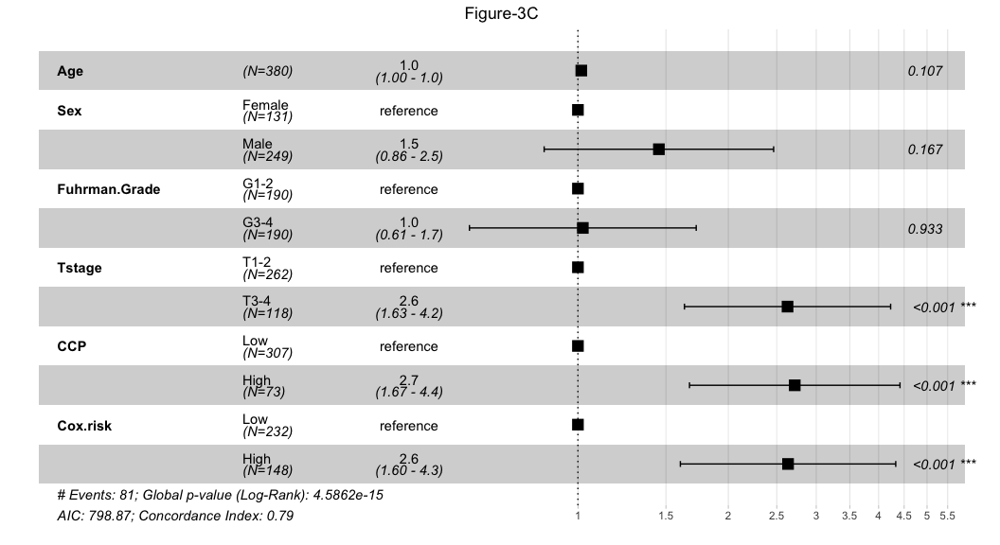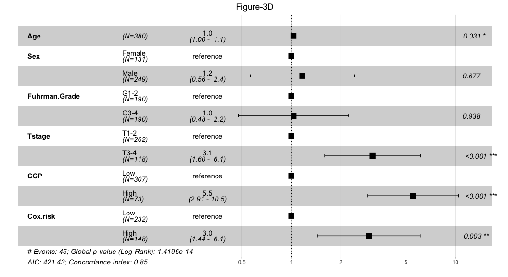

# Prepare files to plot Figures-4

``` r
mas.valid <- read.csv("/Users/srnallan/Desktop/Morgan lab/prolaris_131119/Analysis/df.des.mas.valid.csv",row.names = 1,header = T)
mas.valid$Risk <- factor(mas.valid$Risk,levels = c("Low","High"))
mas.valid$Fuhrman.Grade <- factor(mas.valid$Fuhrman.Grade,levels = c("G1-2","G3-4"))
mas.valid$Tstage <- factor(mas.valid$Tstage,levels = c("T1-2","T3-4"))
mas.valid$CCP <- factor(mas.valid$CCP,levels=c("Low","High"))

# PFI
cox_fit1.mas <- survfit(Surv(PFI.time, PFI.obs) ~ Risk, data=mas.valid)
g1.mas <- ggsurvplot(cox_fit1.mas,pval = T, risk.table = T,break.time.by=60,legend.title="Group:",
                     title=paste0("Figure-4A"),
                     xlab="Disease-Free Survival (Time in months)",
                     surv.median.line = "hv", palette = c("blue","red"))
g1.mas

# OS
cox_fit2.mas <- survfit(Surv(OS.time, OS.obs) ~ Risk, data=mas.valid)
g2.mas <- ggsurvplot(cox_fit2.mas,pval = T, risk.table = T,break.time.by=60,legend.title="Group:",
                     title=paste0("Figure-4B"),
                     xlab="Overall Survival (Time in months)",
                     surv.median.line = "hv", palette = c("blue","red"))
g2.mas

## Cox PFI
coxfit3 <- coxph(Surv(PFI.time,PFI.obs) ~ Age+Sex+Fuhrman.Grade+Tstage+CCP+Risk,data=mas.valid)
ggforest(coxfit3,fontsize = 1,main = paste0("Figure-4C"))

## Cox OS
coxfit4 <- coxph(Surv(OS.time,OS.obs) ~ Age+Sex+Fuhrman.Grade+Tstage+CCP+Risk,data=mas.valid)
ggforest(coxfit4,fontsize = 1,main = paste0("Figure-4D"))
```

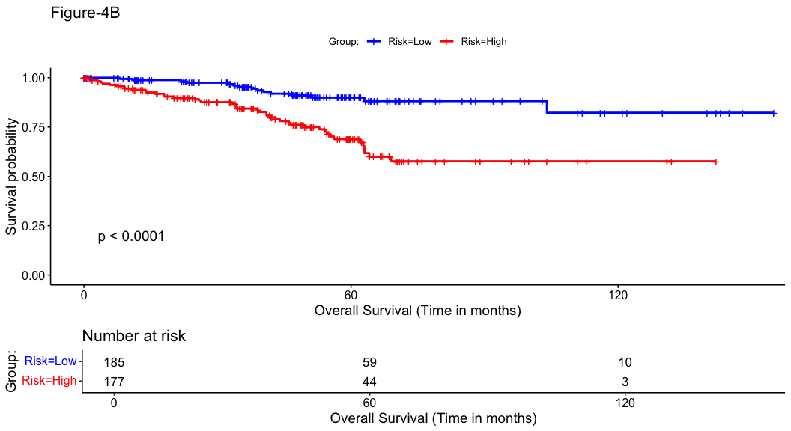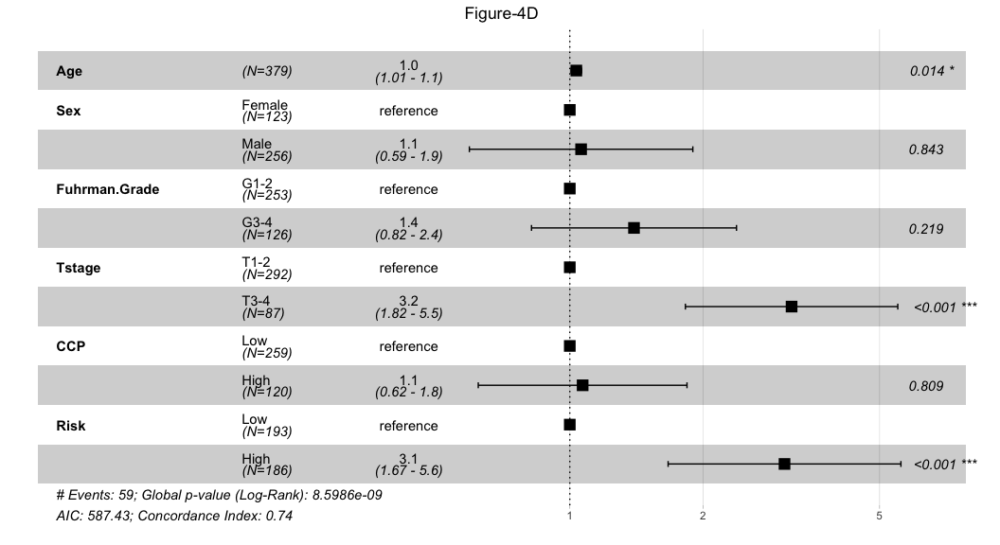

# Prepare files to plot Figures-5

``` r
# Subset logcounts matrix to 15G signature genes
xg15 <- c("IGF2BP3","PTK6","BOLA3","UQCRH","TFCP2L1","SLC7A8","SLC16A1","PLIN5","TMEM136",
          "SLC7A1","TMEM81","RPL22L1","ELOB","IQCC","TAGLN2")

e.symb <- y[[3]]
e.symb <- e.symb[e.symb$gene_name %in% xg15,]

e.sel <- data.matrix(e[rownames(e) %in% rownames(e.symb),])
e.sel <- sweep(e.sel,1,apply(e.sel,1,median))

e.symb <- e.symb[match(rownames(e.sel),rownames(e.symb)),]
# e.sel <- scale(e.sel)

x.comp <- hclust(dist(cosine(e.sel),method="euclidean"),method="complete")

e.sel[e.sel >= 4] <- 4
e.sel[e.sel <= -4] <- -4

all(rownames(e.symb)==rownames(e.sel))
```

    ## [1] TRUE

``` r
tide <- read.csv("/Users/srnallan/Desktop/Morgan lab/prolaris_131119/Analysis/TIDE_UM_CCRCC.csv",header = T)
annotations <- pData(filtered.eset)
annotations <- annotations[rownames(annotations) %in% colnames(e.sel),c(5,6,8,29,30,17,18,19,20,24,25,34)]
annotations <- annotations[,c(6,7,9,10,12,1,2,3)]
all(rownames(annotations)==colnames(e.sel))
```

    ## [1] TRUE

``` r
tide <- tide[tide$Patient %in% rownames(annotations),]
tide <- tide[match(rownames(annotations),tide$Patient),]
all(tide$Patient==rownames(annotations))
```

    ## [1] TRUE

``` r
res.g15 <- read.csv("/Users/srnallan/Desktop/Morgan lab/prolaris_131119/Analysis/training results myriad.csv",header = T,row.names = 1)
all(rownames(annotations)==rownames(res.g15))
```

    ## [1] TRUE

``` r
annotations$Tstage <- factor(annotations$Tstage,
                             levels = c("1a","1b","2a","2b","3a","3b","3c"),
                             labels = c("1","1","2","2","3a","3b","3c"))
annotations$Grade <- factor(annotations$Grade)
annotations$annotation <- factor(annotations$annotation,
                                 levels=c("Primary no MET","Primary with MET"),
                                 labels = c("No","Yes"))
annotations <- data.frame(Risk.15G=factor(res.g15$Cox.risk,levels = c("Low","High")),
                          TIDE=factor(tide$Responder,
                                      levels = c("True","False"),
                                      labels = c("Responder","Non-responder")),
                          annotations,row.names = rownames(annotations))
names(annotations)[[10]] <- "Recurrence"

Var1 <- c("gray80","gray70","gray40","gray20","black")
Var2 <- c("gray","#fdbf6f","green","maroon")
Var3 <- c("#3182bd","red")
Var4 <- c("black","gray80","gray40")
Var5 <- c("white","black")
Var6 <- c("black","white")
Var7 <- c("black","white")
Var8 <- c("white","gray60","gray20")
Var9 <- c("black","white")
Var10 <- c("#ff7f00","white")
Var11 <- c("lightpink","white")
Var12 <- c("lightpink","paleturquoise")
Var13 <- c("khaki1","orchid3")
Var14 <- c("turquoise","purple3")

names(Var1) <- names(summary(annotations$Tstage))
names(Var2) <- names(summary(annotations$Grade))
names(Var3) <- names(summary(annotations$Recurrence))
names(Var6) <- names(summary(annotations$Necrosis))
names(Var7) <- names(summary(annotations$Angiolymphatic.invasion))
names(Var9) <- names(summary(annotations$Adjuvant.therapy))
names(Var10) <- names(summary(annotations$Died.of.Disease))
names(Var12) <- names(summary(annotations$Sex))
names(Var13) <- names(summary(annotations$TIDE))
names(Var14) <- names(summary(annotations$Risk.15G))

ann_colors = list(Tstage = Var1,Grade=Var2,Recurrence = Var3,Necrosis=Var6,
                  Angiolymphatic.invasion=Var7,Adjuvant.therapy=Var9,Died.of.Disease=Var10,
                  Sex=Var12,TIDE=Var13,Risk.15G=Var14)

all(rownames(e.symb)==rownames(e.sel))
```

    ## [1] TRUE

``` r
all(colnames(e.sel)==rownames(annotations))
```

    ## [1] TRUE

``` r
colors.hm <- colorRampPalette(c("#2b83ba","#abdda4","#ffffbf","#fc8d59","#d7191c"))(100)
annotations <- orderBy(~Risk.15G+Recurrence,annotations)
e.sel <- e.sel[,match(rownames(annotations),colnames(e.sel))]
all(colnames(e.sel)==rownames(annotations))
```

    ## [1] TRUE

``` r
# Draw heatmap
out.comp <- pheatmap(e.sel, color = colors.hm, annotation_colors = ann_colors,cellheight = 10,
                     fontsize_row = 10,labels_row = e.symb$gene_name,show_colnames = F,
                     clustering_distance_rows = "correlation",cluster_cols = F,gaps_col = 51,
                     annotation_col = annotations,main = "15 genes UM cohort")


################# Differential expression by 15G Risk groups n91
df.des <- pData(filtered.eset)
all(rownames(df.des)==rownames(res.g15))
```

    ## [1] TRUE

``` r
df.des$Risk <- res.g15$Cox.risk

risk <- factor(res.g15$Cox.risk,levels = c("Low","High"))
table(risk)
```

    ## risk
    ##  Low High 
    ##   51   40

``` r
# COX high vs low risk
design <- model.matrix(~0+risk)
rownames(design) <- rownames(df.des)
colnames(design)
```

    ## [1] "riskLow"  "riskHigh"

``` r
y.voo <- voom(y[rownames(y) %in% rownames(e),colnames(y) %in% rownames(design)],design,plot=F)
fit.voom <- lmFit(y.voo,design)
contrast.matrix <- makeContrasts(
  comp1 = riskHigh - riskLow,
  levels=design)
tmp <- contrasts.fit(fit.voom,contrast.matrix)
tmp <- eBayes(tmp)

# Set cut-offs for significance
fdr <- 0.05
logfc <- 0.585

top.table1 <- topTable(tmp,coef = 1, sort.by = "P", n = Inf)
topdeg1 <- subset(top.table1,adj.P.Val < fdr)
topdeg1$Comparison <- "Limma 15G High vs Low"
topdeg1$Direction <- ifelse(topdeg1$logFC > logfc,"Up","Down")
topdeg1$Method <- "limma-voom"
top.table1 <- top.table1[!top.table1$gene_name %in% top.table1[duplicated(top.table1$gene_name),]$gene_name,]
rownames(top.table1) <- top.table1$gene_name

# fgsea limma
dfgsea <- top.table1
ranks1 <- dfgsea[order(-dfgsea[,"logFC"]),]$logFC
names(ranks1) <- dfgsea[order(-dfgsea[,"logFC"]),]$gene_name
table(factor(ifelse(ranks1>0,"Up","Down")))
```

    ## 
    ## Down   Up 
    ## 8464 7881

``` r
set.seed(123)
fgseaRes1 <- fgseaMultilevel(all.sig1,ranks1,minSize=10,maxSize = 500,gseaParam = 1,eps=0)
fgseaRes1$Comparison <- "Training; 15G High vs Low"


############################################################################# Validation in TCGA
raw.counts <- read.csv("/Users/srnallan/Dropbox (University of Michigan)/RCC datasets/TCGA/TCGA KIRC RAW COUNTS n538 PRIMARY TUMORS.csv",header = T,row.names = 1)
colnames(raw.counts) <- gsub("\\.01A.*","",colnames(raw.counts))
raw.anno <- read.csv("/Users/srnallan/Dropbox (University of Michigan)/RCC datasets/TCGA/Gene annotations.csv",header = T,row.names = 1)
rawc.pheno <- read.csv("/Users/srnallan/Dropbox (University of Michigan)/RCC datasets/TCGA/New_TCGA_KIRC_Outcomes_pheno.csv",header = T)
rawc.pheno$bcr_patient_barcode <- gsub("-",".",rawc.pheno$bcr_patient_barcode,fixed = T)
rownames(rawc.pheno) <- rawc.pheno$bcr_patient_barcode

length(intersect(colnames(raw.counts),rownames(rawc.pheno)))
```

    ## [1] 526

``` r
# Subset to M0 only
rawc.pheno <- rawc.pheno[rawc.pheno$AJCC_METASTASIS_PATHOLOGIC_PM=="M0",]

length(intersect(colnames(raw.counts),rownames(rawc.pheno)))
```

    ## [1] 416

``` r
# Remove non ccRCC histology
rem.ids <- read.csv("/Users/srnallan/Desktop/Morgan lab/prolaris_131119/TCGA_ids_to_exclude.csv",header = T,row.names = 1)
rem.ids <- gsub("\\.01A.*","",rem.ids$SAMPLE)
rawc.pheno <- rawc.pheno[!rownames(rawc.pheno) %in% rem.ids,]

length(intersect(colnames(raw.counts),rownames(rawc.pheno)))
```

    ## [1] 382

``` r
raw.counts <- raw.counts[,colnames(raw.counts) %in% rownames(rawc.pheno)]
rawc.pheno <- rawc.pheno[rownames(rawc.pheno) %in% colnames(raw.counts),]
rawc.pheno <- rawc.pheno[match(colnames(raw.counts),rownames(rawc.pheno)),]

rawc.pheno$Grade.group <- factor(ifelse(rawc.pheno$histological_grade %in% c("G1","G2"),"G1-2",
                                        ifelse(rawc.pheno$histological_grade %in% c("G3","G4"),"G3-4","Unknown")),
                                 levels = c("Unknown","G1-2","G3-4"))
rawc.pheno$Tstage.group <- factor(ifelse(rawc.pheno$AJCC_TUMOR_PATHOLOGIC_PT %in% c("T1","T1a","T1b","T2","T2a","T2b"),"T1-2",
                                         ifelse(rawc.pheno$AJCC_TUMOR_PATHOLOGIC_PT %in% c("T3","T3a","T3b","T3c","T4"),"T3-4","Unknown")),
                                  levels = c("Unknown","T1-2","T3-4"))

tcga.g15 <- read.csv("/Users/srnallan/Desktop/Morgan lab/prolaris_131119/Analysis/testing results tcga.csv",header = T,row.names = 1)
all(rownames(rawc.pheno)==rownames(tcga.g15))
```

    ## [1] TRUE

``` r
rawc.pheno$Risk.15G <- tcga.g15$Cox.risk

all(rownames(raw.counts)==rownames(raw.anno))
```

    ## [1] TRUE

``` r
all(rownames(rawc.pheno)==colnames(raw.counts))
```

    ## [1] TRUE

``` r
# Create DGE list
y.tcga   <- DGEList(count = raw.counts, genes= raw.anno, remove.zeros=T,lib.size = colSums(raw.counts))

# Normalization
y.tcga <- calcNormFactors(y.tcga)
dim(y.tcga)
```

    ## [1] 55222   382

``` r
# Filter low expression genes
selr <- rowSums(cpm(y.tcga$counts)>1)>=50  #(round(ncol(y)/2,digits = 0))
selc <- colSums(y.tcga$counts)>=4500000 #Filter samples based on library size
y.tcga <- y.tcga[selr,selc]
dim(y.tcga)
```

    ## [1] 17704   382

``` r
### Exclude gender specific genes from the analysis
data(genderGenes)
y.tcga <- y.tcga[!(y.tcga$genes$Gene %in% c(XiEgenes,msYgenes)),]
dim(y.tcga)
```

    ## [1] 17704   382

``` r
### log CPM
e.tcga <- cpm(y.tcga,log =T)

xg15 <- c("IGF2BP3","PTK6","BOLA3","UQCRH","TFCP2L1","SLC7A8","SLC16A1","PLIN5","TMEM136",
          "SLC7A1","TMEM81","RPL22L1","ELOB","IQCC","TAGLN2")

raw.anno1 <- raw.anno[raw.anno$Gene %in% xg15,]
e.tcga.sub <- e.tcga[rownames(e.tcga) %in% rownames(raw.anno1),]
all(rownames(raw.anno1)==rownames(e.tcga.sub))
```

    ## [1] TRUE

``` r
e.tcga.sub <- data.matrix(e.tcga.sub)
e.tcga.sub <- sweep(e.tcga.sub,1,apply(e.tcga.sub,1,median))
# e.tcga.sub <- scale(e.tcga.sub)

e.tcga.sub[e.tcga.sub >= 4] <- 4
e.tcga.sub[e.tcga.sub <= -4] <- -4

all(rownames(raw.anno1)==rownames(e.tcga.sub))
```

    ## [1] TRUE

``` r
############################################### Heatmap 15G
tide.tcga.sub <- read.csv("/Users/srnallan/Dropbox (University of Michigan)/RCC datasets/TCGA/For cibersort/TCGA CCRCC ICB.csv",header = T)
tide.tcga.sub <- tide.tcga.sub[match(rownames(rawc.pheno),tide.tcga.sub$Patient),]
all(tide.tcga.sub$Patient==rownames(rawc.pheno))
```

    ## [1] TRUE

``` r
rawc.pheno$TIDE <- factor(tide.tcga.sub$Responder,levels = c("True","False"),labels = c("Responder","Non-responder"))

anntcga <- rawc.pheno[,c(44,45,36,4,9,35,27,31)]
colnames(anntcga)[[3]] <- "Genome.altered"
colnames(anntcga)[[4]] <- "Sex"
colnames(anntcga)[[6]] <- "Tstage"
colnames(anntcga)[[5]] <- "Grade"
colnames(anntcga)[[7]] <- "Died.of.disease"
colnames(anntcga)[[8]] <- "Recurrence"
anntcga$Risk.15G <- factor(anntcga$Risk.15G,levels = c("Low","High"))
anntcga$Sex <- factor(anntcga$Sex,levels = c("FEMALE","MALE"),labels = c("Female","Male"))
anntcga$Died.of.disease <- ifelse(is.na(anntcga$Died.of.disease),"Unknown",anntcga$Died.of.disease)
anntcga$Died.of.disease <- factor(ifelse(anntcga$Died.of.disease==0,"No",ifelse(anntcga$Died.of.disease==1,"Yes","Unknown")),
                                  levels = c("Unknown","No","Yes"))
anntcga$Recurrence <- factor(ifelse(anntcga$Recurrence==0,"No","Yes"),
                                  levels = c("No","Yes"))
anntcga$Grade <- factor(anntcga$Grade,levels = c("[Not Available]","GX","G1","G2","G3","G4"),labels = c("Unknown","Unknown","1","2","3","4"))
anntcga$Tstage <- ifelse(is.na(anntcga$Tstage),"Unknown",anntcga$Tstage)
anntcga$Tstage <- factor(anntcga$Tstage,levels = c("Unknown","T1","T1a","T1b","T2","T2a","T2b","T3","T3a","T3b","T3c","T4"),
                         labels = c("Unknown","1","1","1","2","2","2","3a","3a","3b","3c","4"))

Var1 <- c("white","gray80","gray70","gray50","gray40","gray20","black")
Var2 <- c("white","gray","#fdbf6f","green","maroon")
Var3 <- c("#3182bd","red")
Var4 <- c("gray","white","#ff7f00")
Var6 <- c("lightpink","paleturquoise")
Var8 <- c("turquoise","purple3")
Var10 <- c("khaki1","orchid3")

names(Var1) <- names(summary(anntcga$Tstage))
names(Var2) <- names(summary(anntcga$Grade))
names(Var3) <- names(summary(anntcga$Recurrence))
names(Var4) <- names(summary(anntcga$Died.of.disease))
names(Var6) <- names(summary(anntcga$Sex))
names(Var8) <- names(summary(anntcga$Risk.15G))
names(Var10) <- names(summary(anntcga$TIDE))

ann_colors1 = list(Tstage = Var1,Grade=Var2,Recurrence = Var3,
                   Died.of.disease=Var4,Sex=Var6,Risk.15G=Var8,TIDE=Var10)

all(rownames(raw.anno1)==rownames(e.tcga.sub))
```

    ## [1] TRUE

``` r
all(colnames(e.tcga.sub)==rownames(anntcga))
```

    ## [1] TRUE

``` r
colors.hm <- colorRampPalette(c("#2b83ba","#abdda4","#ffffbf","#fc8d59","#d7191c"))(100)

anntcga <- orderBy(~Risk.15G+Recurrence,anntcga)
e.tcga.sub <- e.tcga.sub[,match(rownames(anntcga),colnames(e.tcga.sub))]
all(colnames(e.tcga.sub)==rownames(anntcga))
```

    ## [1] TRUE

``` r
# Draw heatmap
out.comp1 <- pheatmap(e.tcga.sub, color = colors.hm, annotation_colors = ann_colors1,fontsize_col = 4,labels_row = raw.anno1$Gene,
                     cluster_cols = F,clustering_distance_rows = "correlation",fontsize_row = 10,show_colnames = F,
                     gaps_col = 233,cellheight = 10,annotation_col = anntcga,main = "15 Gene expression TCGA Cohort")


# Differential expression by 15G Risk groups n382
risk <- factor(rawc.pheno$Risk.15G,levels = c("Low","High"))
# risk <- factor(rawc.pheno$IGF2BP3,levels = c("Low","High"))
table(risk)
```

    ## risk
    ##  Low High 
    ##  233  149

``` r
# COX high vs low risk
design <- model.matrix(~0+risk)
rownames(design) <- rownames(rawc.pheno)
colnames(design)
```

    ## [1] "riskLow"  "riskHigh"

``` r
# limma voom
y.voo <- voom(y.tcga[,colnames(y.tcga) %in% rownames(design)],design,plot=F)
fit.voom <- lmFit(y.voo,design)
contrast.matrix <- makeContrasts(
  comp1 = riskHigh - riskLow,
  levels=design)
tmp <- contrasts.fit(fit.voom,contrast.matrix)
tmp <- eBayes(tmp)

# Set cut-offs for significance
fdr <- 0.05
logfc <- 0.585

top.table2 <- topTable(tmp,coef = 1, sort.by = "P", n = Inf)
topdeg2 <- subset(top.table2,adj.P.Val < fdr)
# topdeg2$Comparison <- "Limma IGF2BP3 High vs Low"
topdeg2$Direction <- ifelse(topdeg2$logFC > logfc,"Up","Down")
topdeg2$Method <- "limma-voom"
top.table2 <- top.table2[!top.table2$Gene %in% top.table2[duplicated(top.table2$Gene),]$Gene,]
rownames(top.table2) <- top.table2$Gene

# fgsea limma
dfgsea <- top.table2
ranks1 <- dfgsea[order(-dfgsea[,"logFC"]),]$logFC
names(ranks1) <- dfgsea[order(-dfgsea[,"logFC"]),]$Gene
table(factor(ifelse(ranks1>0,"Up","Down")))
```

    ## 
    ## Down   Up 
    ## 9916 7778

``` r
set.seed(123)
fgseaRes2 <- fgseaMultilevel(all.sig1,ranks1,minSize=10,maxSize = 500,gseaParam = 1,eps=0)
fgseaRes2$Comparison <- "TCGA; 15G High vs Low"

############## Fgseplots combined - Figure - 5D
tops <- rbind(fgseaRes1,fgseaRes2)
tops <- tops[tops$padj < 0.05,]
tops <- tops[,c(1:7,9)]
tops <- tops[grepl("HALLMARK",tops$pathway),]
tops$pathway <- gsub("HALLMARK_","",tops$pathway)
tops$pathway <- gsub("_"," ",tops$pathway)
tops <- tops[!grepl("ESTROGEN",tops$pathway),]
tops <- tops[order(tops$padj,decreasing = F),]
tops$pathway <- factor(tops$pathway,levels = unique(c(tops$pathway)))

tops$Comparison <- factor(tops$Comparison, levels = c("Training; 15G High vs Low",
                                                      "TCGA; 15G High vs Low"))

tops$NES <- as.numeric(round(tops$NES,digits=2))
tops$Direction <- factor(ifelse(tops$padj < 0.05 & tops$NES>0,"Enriched in 15G High",
                                ifelse(tops$padj < 0.05 & tops$NES<0,"Enriched in 15G Low","Not significant")),
                         levels = c("Enriched in 15G High", "Enriched in 15G Low","Not significant"))
tops <- tops[!tops$Direction=="Not significant",]
tops$absNES <- abs(tops$NES)

# ggplot Volcano plots plus hallmark plot
fill <- c("red","#3182bd")

g1 <- ggplot(tops, aes(x = Comparison, y = pathway, size = absNES, fill = Direction)) +
  geom_point(shape = 21, alpha = 0.7) +
  scale_fill_manual(values =fill) +
  theme(panel.grid.major = element_blank(), panel.grid.minor = element_blank(),
        panel.background = element_blank(), axis.line = element_line(colour = "black"),
        legend.text=element_text(size=10,colour = "black")) + scale_y_discrete(limits = rev(levels(factor(tops$pathway)))) +
  scale_size(range = c(3,8),breaks = c(1,1.5,2)) +
  # ggtitle("edgeR common DEGs") +
  xlab("")+ylab("")+theme_bw() +
  scale_x_discrete(position = "top") + 
  theme(axis.text.x.top = element_text(angle = 30, vjust = 0, hjust = 0,face="bold",size=10,colour = "black")) +
  theme(axis.text.y = element_text(size =  10,colour = "black")) +
  theme(axis.text=element_text(size=20), legend.text=element_text(size=12))+
  guides(size=guide_legend(title="Normalized Enrichment Score (NES)", title.theme = element_text(
    size = 12,
    colour = "black",
    face = "bold",
    angle = 0))) +
  guides(fill=guide_legend(title="Direction", override.aes = list(size=10), title.theme = element_text(
    size = 12,
    colour = "black",
    face = "bold",
    angle = 0))) #+ coord_equal(2/6)
g1


############## Fgseplots combined - Figure - 5E
tops <- rbind(fgseaRes1,fgseaRes2)
tops <- tops[tops$padj < 0.05,]
tops <- tops[,c(1:7,9)]
tops <- tops[!grepl("HALLMARK",tops$pathway),]
# tops$pathway <- gsub("HALLMARK_","",tops$pathway)
tops$pathway <- gsub("_"," ",tops$pathway)
tops <- tops[order(tops$padj,decreasing = F),]
tops$pathway <- factor(tops$pathway,levels = unique(c(tops$pathway)))

tops$Comparison <- factor(tops$Comparison, levels = c("Training; 15G High vs Low",
                                                      "TCGA; 15G High vs Low"))

tops$NES <- as.numeric(round(tops$NES,digits=2))
tops$Direction <- factor(ifelse(tops$padj < 0.05 & tops$NES>0,"Enriched in 15G High",
                                ifelse(tops$padj < 0.05 & tops$NES<0,"Enriched in 15G Low","Not significant")),
                         levels = c("Enriched in 15G High", "Enriched in 15G Low","Not significant"))
tops <- tops[!tops$Direction=="Not significant",]
tops$absNES <- abs(tops$NES)

# ggplot Volcano plots plus hallmark plot
fill <- c("red","#3182bd")

g2 <- ggplot(tops, aes(x = Comparison, y = pathway, size = absNES, fill = Direction)) +
  geom_point(shape = 21, alpha = 0.7) +
  scale_fill_manual(values =fill) +
  theme(panel.grid.major = element_blank(), panel.grid.minor = element_blank(),
        panel.background = element_blank(), axis.line = element_line(colour = "black"),
        legend.text=element_text(size=10,colour = "black")) + scale_y_discrete(limits = rev(levels(factor(tops$pathway)))) +
  scale_size(range = c(3,8),breaks = c(1,1.5,2)) +
  # ggtitle("edgeR common DEGs") +
  xlab("")+ylab("")+theme_bw() +
  scale_x_discrete(position = "top") + 
  theme(axis.text.x.top = element_text(angle = 30, vjust = 0, hjust = 0,face="bold",size=10,colour = "black")) +
  theme(axis.text.y = element_text(size =  10,colour = "black")) +
  theme(axis.text=element_text(size=20), legend.text=element_text(size=12))+
  guides(size=guide_legend(title="Normalized Enrichment Score (NES)", title.theme = element_text(
    size = 12,
    colour = "black",
    face = "bold",
    angle = 0))) +
  guides(fill=guide_legend(title="Direction", override.aes = list(size=10), title.theme = element_text(
    size = 12,
    colour = "black",
    face = "bold",
    angle = 0))) #+ coord_equal(2/6)
g2
```

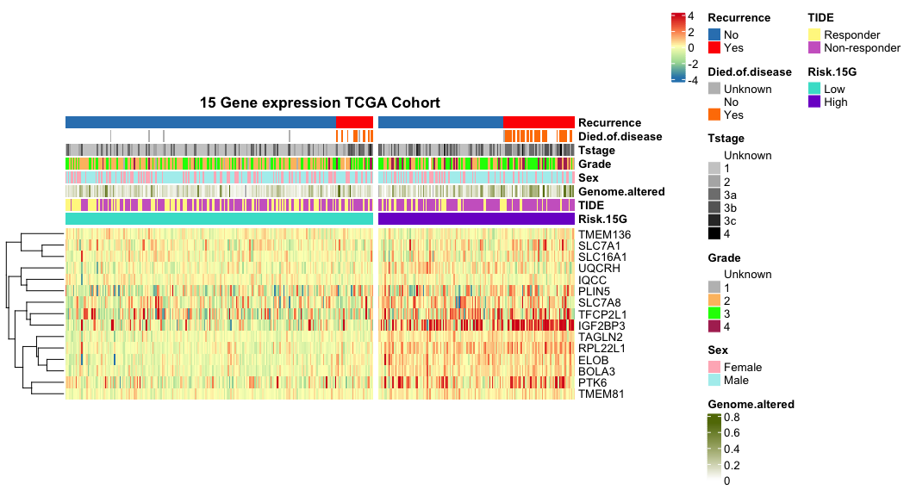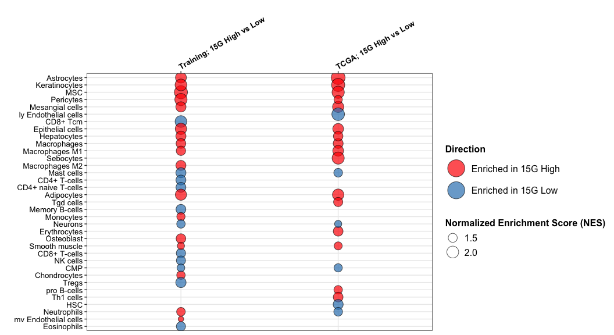
